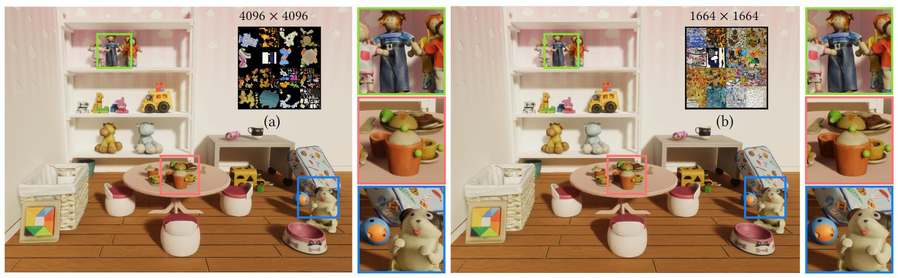

# **Texture Atlas Compression Based on Repeated Content Removal**



## Abstract

Optimizing the memory footprint of 3D models can have a major impact on the user experiences during real-time rendering and streaming visualization, where the major memory overhead lies in high-resolution texture data. In this work, we propose a robust and automatic pipeline to content-aware, lossy compression for texture atlas. The design of our solution lies in two observations: 1) mapping multiple surface patches to the same texture region is seamlessly compatible with the standard rendering pipeline, requiring no decompression before any usage; 2) a texture image has background regions and salient structural features, which can be handled separately to achieve a high compression rate. Accordingly, our method contains three phases. We first factor out redundant salient texture contents by detecting such regions and mapping their corresponding 3D surface patches to a single UV patch via a UV-preserving re-meshing procedure. We then compress redundant background content by clustering triangles into groups by their color. Finally, we create a new UV atlas with all repetitive texture contents removed and bake a new texture via differentiable rendering to remove potential inter-patch artifacts. To evaluate the efficacy of our approach, we batch-processed a dataset containing 100 models collected online. On average, our method achieves a texture atlas compression ratio of 81.80% with an averaged PSNR and MS-SSIM scores of 40.68 and 0.97, a marginal error in visual appearance.

[[Paper](https://drive.google.com/file/d/1SR04vTjbzfxdrgipOBvN6jv_x6D0rHgX/view?usp=sharing)]

## Installation

Requirements:
 - [Microsoft Visual Studio](https://visualstudio.microsoft.com/) 2019+ with Microsoft Visual C++ installed
 - [Cuda](https://developer.nvidia.com/cuda-toolkit) 10.2+
 - [Pytorch](https://pytorch.org/) 1.6+
 - [OpenCV](https://opencv.org/)

Tested in Anaconda3 with Python 3.8 and PyTorch 1.12 + Cuda 11.3

### Setup (Windows)

1. Install [Microsoft Visual Studio](https://visualstudio.microsoft.com/) 2019+ with Microsoft Visual C++. 
2. Place the [opencv_world455.dll](https://drive.google.com/file/d/1HR7hME28Qw3O54GeV-CXuHKTqBOsQSXZ/view?usp=drive_link) file in the `Code` folder directory.
3. Install [Cuda](https://developer.nvidia.com/cuda-toolkit) 10.2 or above. **Note:** Install CUDA toolkit from https://developer.nvidia.com/cuda-toolkit (not through anaconda)
4. Install the appropriate version of PyTorch compatible with the installed Cuda toolkit.
5. Install [nvdiffrast](https://github.com/NVlabs/nvdiffrast) in conda env. Follow the [installation instructions](https://nvlabs.github.io/nvdiffrast/#windows).
6. Install Segment Anything:
   ```python
   pip install git+https://github.com/facebookresearch/segment-anything.git
   ```
8. download the [ViT-L SAM model](https://dl.fbaipublicfiles.com/segment_anything/sam_vit_l_0b3195.pth), put it in the `Code` folder like `Code\sam_vit_l_0b3195.pth`

## Examples

[Additional test models can be downloaded here](https://app.gazebosim.org/GoogleResearch/fuel/collections/Scanned%20Objects%20by%20Google%20Research)
Unzip and place the model and texture file in the project `input_Path` folder:

e.g., `input_Path\model.obj`，`input_Path\texture.png`
(Texture size is currently supported only for 1024x1024 dimensions.)

Change into the `AtlasCompress\Code` directory and run:

```python
python AtlasCompress.py --PSNR_thred 38.0 --error_theta 10.0 --data_Path "input_path" --output_Path "output_path"
```
The results will be stored in the `output_Path` folder.

## Cite

```
@article{luo23atlascompress,
   title = {Texture Atlas Compression Based on Repeated Content Removal},
   author = {Luo, Yuzhe and Jin, Xiaogang and Pan, Zherong and Wu, Kui and Kou, Qilong and Yang, Xiajun and Gao, Xifeng},
   booktitle = {SIGGRAPH Asia 2023 Conference Papers},
   pages = {1--10},
   year = {2023}
  }
```

